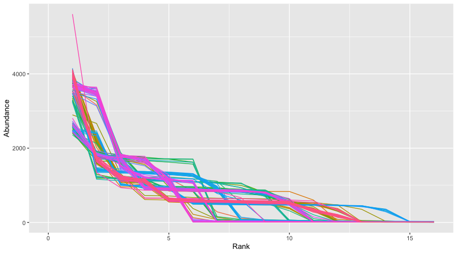

# Amplicon Analysis

Create sample list
```
code for sample list - edit when new files arrive
```

Create sample file for mothur
```
while read sample; do echo "../"$sample".R1.fastq.gz	../"$sample".R2.fastq.gz" > $sample.file; done < sample.list
```

Join overlapping reads to form contigs using mothur make.contigs
```
while read sample; do mothur "#make.contigs(file=$sample.file)"; done < sample.list
```

Filter for reads 300-500bp long with no ambiguous bases
```
while read sample; do mothur "#make.contigs(file=$sample.file)"; done < sample.list
```

Use cutadapt to remove primer sequences
```
while read sample; do cutadapt --trimmed-only -a ^AGAACATGGCCTCGTTCAAG...TTGGGCTACATGTTTAGCTAG$ -o $sample.cuta.fasta $sample.trim.contigs.trim.fasta; done < sample.list
```
***Use this when you get remaining samples from Jason ^

Create list of samples with >15,000 reads (excludes 6 samples with insufficient reads from further analysis)
```
wc -l *.cuta.fasta | awk '$1 > 30000' | grep -v "total" | awk '{print $2}' | sed -E 's/(.*).cuta.fasta/\1/' > sample.15k.list
```

Calculate the abundance of the 30 most abundant sequences in each individual.
```
while read sample; do seqkit shuffle $sample.cuta.fasta | seqkit seq -w0 | head -30000 | grep -v ">" | sort | uniq -c | awk '{print $1}' | sort -k1,1nr | head -30 | awk -v sample=$sample '{print sample"\t"NR"\t"$1}'; done > read.abun.15k < sample.15k.list
```

Can plot this in R:
```
library(ggplot)
abunread=read.table("read.abun.15k",header=FALSE)
ggplot(abunread,aes(V2,V3))+geom_line(aes(color=V1))+theme(legend.position = "none")+xlim(c(0,16))+xlab("Rank")+ylab("Abundance")
```




Identify filtering threshold. I.e. abundance in a sample should be >= X and present in more than one sample.
```
while read sample; do seqkit shuffle $sample.cuta.fasta | seqkit seq -w0 | head -30000 | grep -v ">" | sort | uniq -c | awk '$1 >= 300'; done < sample.15k.list | awk '{print $2}' | sort | uniq -c | sort -k1,1nr | awk '$1 > 1' | wc -l
```


