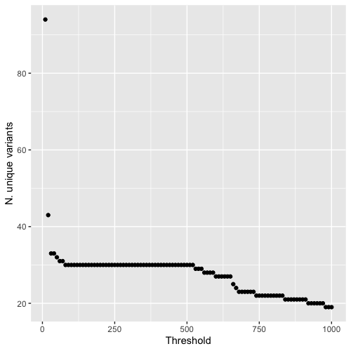

# Amplicon Analysis

Create sample list
```
ls *.R1.fastq.gz | sed -E 's/.R1.fastq.gz//' > sample.list
```

Create sample file for mothur
```
while read sample; do echo "../"$sample".R1.fastq.gz	../"$sample".R2.fastq.gz" > $sample.file; done < sample.list
```

Join overlapping reads to form contigs using mothur make.contigs
```
while read sample; do mothur "#make.contigs(file=$sample.file)"; done < sample.list
```

Filter for reads 300-500bp long with no ambiguous bases
```
while read sample; do mothur "#make.contigs(file=$sample.file)"; done < sample.list
```

Use cutadapt to remove primer sequences
```
while read sample; do cutadapt --trimmed-only -a ^AGAACATGGCCTCGTTCAAG...TTGGGCTACATGTTTAGCTAG$ -o $sample.cuta.fasta $sample.trim.contigs.trim.fasta; done < sample.list
```

Create a list of sample read abundance
```
wc -l *.cuta.fasta | awk '{print $1/2"\t"$2}' | sort -n -k1,1 | grep -v "total" > sample.read.abun
```

From this, we can see that a 156/160 samples have at least 14,800 reads so we'll use this as our threshold.
Create a new sample list of samples with >= 14,800 reads (excludes 4 samples with insufficient reads from further analysis)
```
cat sample.read.abun | awk '$1 >= 14800' | cut -f2 | sed -E 's/.cuta.fasta//' > sample.thresd.list
```

Resample without replacement all fasta files to create fasta files for all individuals with the same read depth (14,800).
```
while read sample; do seqkit shuffle -s 1984 $sample.cuta.fasta | seqkit seq -w0 | head -29600 > $sample.norm.fasta; done < sample.thresd.list
```


Calculate the abundance of the 30 most abundant sequences in each individual.
```
while read sample; do cat $sample.norm.fasta | grep -v ">" | sort | uniq -c | awk '{print $1}' | sort -k1,1nr | head -30 | awk -v sample=$sample '{print sample"\t"NR"\t"$1}'; done > read.abun.thresd < sample.thresd.list
```

Can plot this in R:
```
library(ggplot2)
abunread=read.table("read.abun.15k",header=FALSE)
ggplot(abunread,aes(V2,V3))+geom_line(aes(color=V1))+theme(legend.position = "none")+xlim(c(0,16))+xlab("Rank")+ylab("Abundance")
```


Identify filtering threshold. I.e. abundance in a sample should be >= X and present in more than one sample.
```
while read sample; do cat $sample.norm.fasta | grep -v ">" | sort | uniq -c | awk '$1 >= 300'; done < sample.thresd.list | awk '{print $2}' | sort | uniq -c | sort -k1,1nr | awk '$1 > 1' | wc -l
```

To determine an appropriate threshold, we considered the profile of unique variants vs threshold (see plot below), and the inferred copy number based on counts. I.e. if the number of reads supporting a variant is 460 (out of 14800) and only a single copy of this variant is present in the diploid genome, then this reflects a total diploid copy number of ~32. This total copy number would correspond to perfect amplication of all non-pseudogene variants in our longest haplotype obtained by genome sequencing. We decided on a threshold of 100 reads (reflecting a total diploid copy number of 148), which identifies the same number of unique variants as 460 reads, yet, allows for some deviation from perfect amplication while avoiding issues associated with PCR/sequencing errors and index hopping.




Filter resampled fastas for reads with abundances >= 100 reads. Store abundance in ids
```
while read sample; do cat $sample.norm.fasta | grep -v ">" | sort | uniq -c | sort -nr -k1,1 | awk '$1 >= 100' | awk '{print $1"\t"$2}' | sed -E "s/(.*)\t(.*)/\>$sample.\1\n\2/"; done < sample.thresd.list > abun.gt100.fasta
```

Collapse this fasta to create a list of variants present in greater than 1 individual
```
cat abun.gt100.fasta | grep -v ">" | sort | uniq -c | awk '$1 > 1' | sort -nr -k1,1 | awk '{print $2"\t"$1}' > uniq.gt100.nind
```

Create a fasta of variants ordered by primarily by the number of individuals the sequence is found in and secondly by the total number of reads assigned to this variant
```
while read seq nind; do seqkit fx2tab abun.gt100.fasta | awk -v seq=$seq '$2 == seq' | sed -E 's/\.([0-9]+)/\t\1/' | cut -f2 | paste -sd+ | bc | awk -v seq=$seq -v nind=$nind '{print seq"\t"nind"\t"$1}'; done < uniq.gt100.nind | sort -k2,2nr -k3,3nr | awk '{print ">Nv1.AmpV"NR".nind"$2".nseq"$3"\n"$1}' > nv1.amp.variants.fasta
```

Transform the fasta to a table using seqkit with simplified ids
```
seqkit fx2tab nv1.amp.variants.fasta | sed -E 's/Nv1.AmpV([0-9]+).nind[0-9]+.nseq[0-9]+/\1/' > nv1.amp.variants.tab
```

Create a long format count table to document the read abundance of each variant using the read abundance stored in the ids during the filtering step
```
while read varid seq; do seqkit fx2tab abun.gt100.fasta | awk -v seq=$seq '$2 == seq' | cut -f1 | sed -E 's/\.([0-9]+)/\t\1/' | awk -v varid=$varid '{print $1"\t"$2"\t"varid}'; done < nv1.amp.variants.tab | sort -k1,1 -k2,2nr > nv1.amp.variants.count.table.long
```

Using the R script XXXX to create associated plots.

